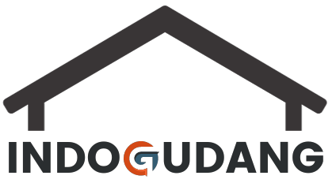

## SISTEM PENYIMPANAN INDOGUDANG 

Program berbasis *Object-Oriented* menggunakan bahasa **JAVA.**
Penerapan OOP pada program:
1. *Inheritance* : Pada Class DataSupplier yang menurunkan sifatnya ke Class Supplier.
2. *Enkapsulasi* : Setiap kelas menerapkan metode Enkapsulasi.
3. *Polymorphisme* : Pada Class Barang yang bersifat *Abstract*
kemudian dimodifikasi oleh setiap Class turunannya
Class (Pakaian, Elektronik, Bahan Makanan, Dokumen).
4. *Abstract Class & Interface* : Abstract Class digunakan pada Class Barang
dan Interface digunakan pada DashboardInterface.
5. *GUI* : Memanfaatkan JFrame yang terhubung dengan database,
GUI Component dibuat di package App.

Program dapat dirunning di 2 tempat:
1. Terminal : Dijalankan di Package Sistem -> Class Dashboard.
2. GUI : Dijalankan di Package App -> Class MainProgram.

### DONT FORGET
1. Mengimport file .jar (ada di Package App -> lib) ke libraries.
2. Mengimport file .sql (dilampirkan) ke local.
3. Create user dengan username : 'admin' & password 'admin' dan 
Grant full access ke file .sql tersebut.

Data Anggota.

| Nama                      | NIM        |
|---------------------------|------------|
| Muhammad Durmuji          | 2210512002 |
| Muhammad Arief Budiman    | 2210512006 |
| Deni Permana              | 2210512015 |
| Tegar Hartoto Rahmatulloh | 2210512017 |
| Haekal Hasan Thanvindra   | 2210512038 |